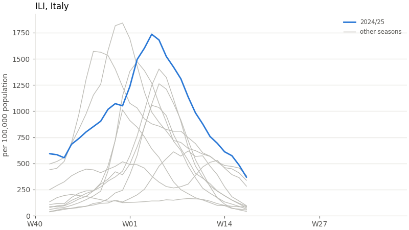
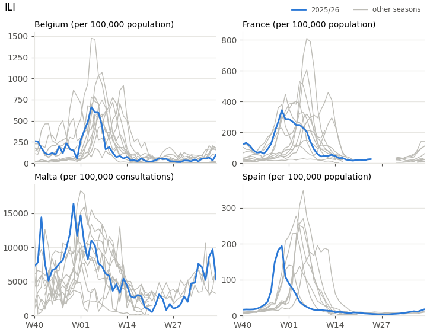
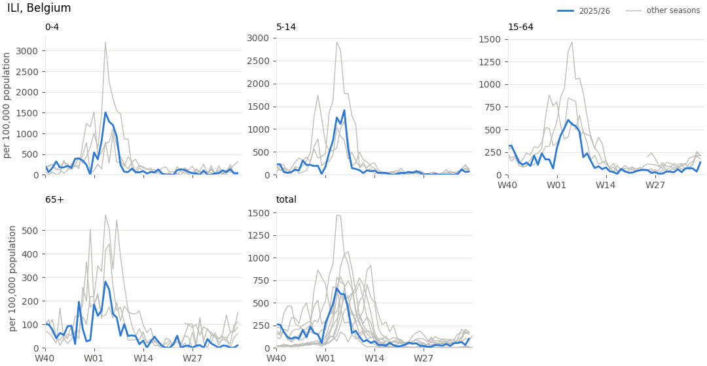
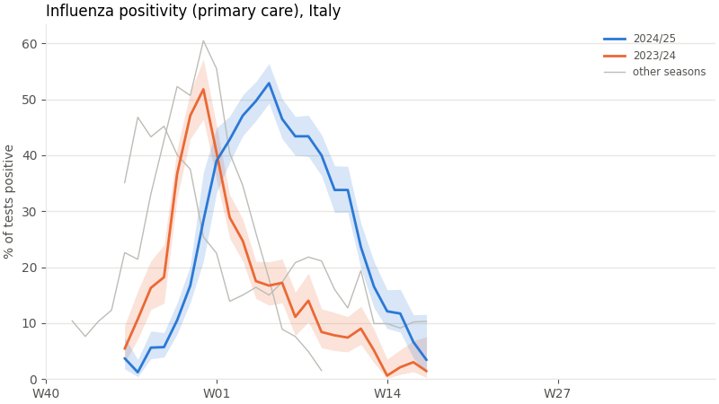

# Plotting

{func}`~pyerviss.plot_seasons` draws the classic surveillance chart: one line per season,
aligned on the week of the season, with past seasons in grey for context and the
current season highlighted. Plotting requires matplotlib:

```bash
pip install "pyerviss[plot]"
```

## Seasons

Pass the result of any query, unchanged:

```python
import pyerviss as pv

df = pv.get_ili(countries="Italy", age_groups="total")
pv.plot_seasons(df)
```



- Seasons run from W40 to W39; the x-axis is the week of the season, so seasons line
  up regardless of the calendar year.
- The most recent season in the data is highlighted. Choose others with
  `highlight="2023/24"` or a list of up to three seasons; the most recent one is blue.
- The y-axis label is the data's `unit`, and the title names the indicator and country.
- Weeks without data are gaps, never interpolated lines.

The data must be **one series**: one indicator, country and age group (for positivity,
also one pathogen and setting). Anything else raises an error saying what to filter:

```text
InvalidParameterError: df has 5 values of age (0-4, 15-64, 5-14, 65+, total); plot_seasons
draws one series per panel. Fix: filter with age_groups="total" (or another group), or use
facet="age"
```

`plot_seasons` returns the matplotlib `Axes`, so you can adjust or save the chart:

```python
ax = pv.plot_seasons(df)
ax.set_ylim(0, 2000)
ax.figure.savefig("ili_italy.png", dpi=150)
```

It never changes matplotlib's global style. Pass `ax=` to draw into an existing figure.

## Comparing countries

`facet="country"` draws one panel per country, with the same season highlighted in each:

```python
df = pv.get_ili(countries=["Belgium", "France", "Spain", "Malta"], age_groups="total")
pv.plot_seasons(df, facet="country")
```



Each panel has its own y-axis, because levels and units differ between countries: here
Malta is per 100,000 consultations (see {doc}`units`), which the panel titles show
whenever units differ. Use `sharey=True` to put all panels on one scale; it is only
allowed when every panel has the same unit. A panel without data for the highlighted
season says so.

## Comparing age groups

`facet="age"` draws one panel per age group, in age order with `total` last:

```python
pv.plot_seasons(pv.get_ili(countries="Belgium"), facet="age")
```



Age-specific data starts in 2022-W25, so these panels show fewer past seasons than
`total`, which goes back to 2014.

`facet` returns the matplotlib `Figure`. Only one facet at a time: for age groups in
several countries, make one plot per country.

## Positivity and uncertainty

{func}`~pyerviss.add_positivity_ci` adds a 95% confidence interval computed from the
`tests` and `detections` counts (Wilson score interval). `plot_seasons` draws it as a
band around highlighted seasons:

```python
pos = pv.get_positivity(pathogen="influenza", setting="primary care", countries="IT")
pv.plot_seasons(pv.add_positivity_ci(pos), highlight=["2023/24", "2024/25"])
```



Wide bands mean few tests. A week with 1 positive out of 1 test has a positivity of 100%
but an interval of roughly 21% to 100%, which the band makes visible.

## With other plotting libraries

{func}`~pyerviss.add_season_week` adds the `season` and `season_week` columns that the
season plot is built on, so you can draw the same chart with seaborn, plotly or plain
pandas:

```python
import seaborn as sns

df = pv.add_season_week(pv.get_ili(countries="Italy", age_groups="total"))
sns.lineplot(data=df, x="season_week", y="value", hue="season")
```
